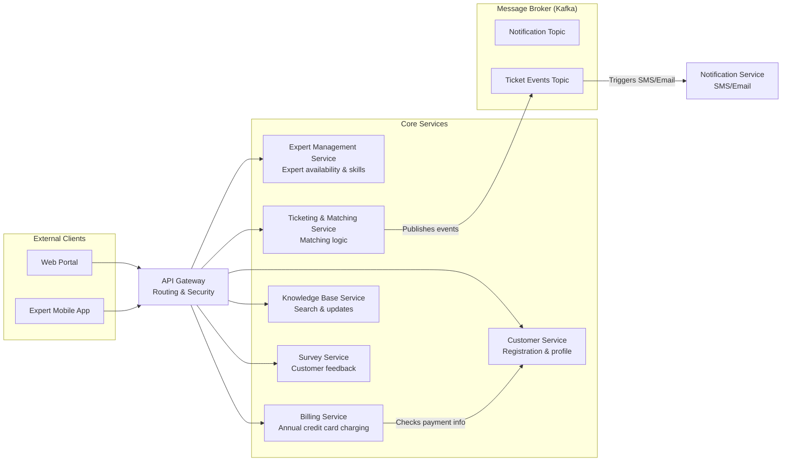

# Ticket System Architecture Recommendation

To modernize Best Electronics' trouble ticket system and address lost tickets, system crashes, and slow delivery of changes, I recommend transitioning to a microservices architecture.

## A. Architectural Characteristics

- **Availability:** Crucial for 24/7 ticket entry by customers and call center staff.
- **Scalability/Elasticity:** Needed to handle spikes in usage that currently cause system freezes.
- **Maintainability/Agility:** Necessary so changes can be made quickly without breaking unrelated parts of the system.
- **Reliability/Data Integrity:** Essential to ensure no trouble tickets are lost during processing.
- **Fault Tolerance:** Prevents a single component failure from bringing down the entire support line.

## B. Scenarios

- **Availability:** The system must maintain 99.9% uptime for the web-based ticket entry portal.
- **Scalability:** The architecture must handle a 5x increase in concurrent users during peak holiday seasons without increasing response times beyond 3 seconds.
- **Maintainability:** A developer should be able to update the expert-matching logic and deploy it within one business day without impacting the billing or survey services.
- **Reliability:** In the event of a network failure during expert notification, the system must persist the ticket and retry notification once connectivity is restored, ensuring no tickets are lost.

## C. Architecture Diagram

## D. Risks

- **Complex Communication:** Managing interactions between many small services is harder than in a monolith.
- **Data Consistency:** It is more difficult to maintain consistency across different service databases.
- **Operational Overhead:** This approach requires strong automation, monitoring, and operational expertise.

## E. Mitigation Options

- **Saga Pattern:** Use sagas to manage distributed transactions, such as billing and ticket completion, and preserve consistency across services.
- **Circuit Breakers:** Implement circuit breakers to prevent a slow service, such as the matching engine, from causing cascading failures.
- **Event-Driven Pub-Sub:** Use a broker such as Kafka for asynchronous communication so messages remain queued if downstream services are temporarily unavailable.
