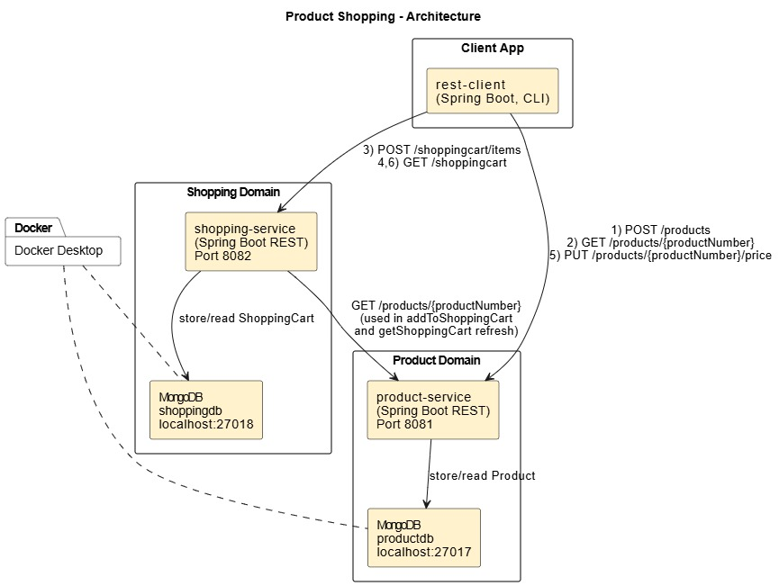

# Lab4 Product Shopping - Part 2

This is a multi-module project:

- `product-service` (port `8081`)
- `shopping-service` (port `8082`)
- `rest-client` (executes steps 1-6 from the lab instructions)

## Architecture Diagram



The diagram represents the implemented runtime architecture:

- `rest-client` calls `product-service` to add/get/update products.
- `rest-client` calls `shopping-service` to add/get shopping cart data.
- `product-service` persists products in MongoDB `productdb` (`localhost:27017`).
- `shopping-service` persists cart data in MongoDB `shoppingdb` (`localhost:27018`).
- `shopping-service` calls `product-service` (`GET /products/{productNumber}`) to load and refresh product details, including price updates reflected in the cart.

## Requirements

- Java 17
- Maven
- Docker Desktop

## MongoDB (2 instances)

From the `lab4-product-shopping` directory:

```powershell
docker compose up -d
```

This starts:

- `product-mongo` on `localhost:27017` (db `productdb`)
- `shopping-mongo` on `localhost:27018` (db `shoppingdb`)

Mongo and service URLs are hardcoded in each module `application.yml`.

## Run the services

Terminal 1:

```powershell
cd product-service
mvn spring-boot:run
```

Terminal 2:

```powershell
cd shopping-service
mvn spring-boot:run
```

## Run the REST client (steps 1-6)

Terminal 3:

```powershell
cd rest-client
mvn spring-boot:run
```

The client prints:

1. add product
2. get product by productNumber
3. add product to shopping cart
4. get shopping cart
5. update product price
6. get shopping cart again (with updated price)

## Endpoints

### Product Service

- `POST /products` -> addProduct
- `GET /products/{productNumber}` -> getProduct
- `PUT /products/{productNumber}/price` -> updateProductPrice

### Shopping Service

- `POST /shoppingcart/items` -> addToShoppingCart
- `GET /shoppingcart` -> getShoppingCart

`getShoppingCart` refreshes item details from `product-service` so price changes are reflected.
