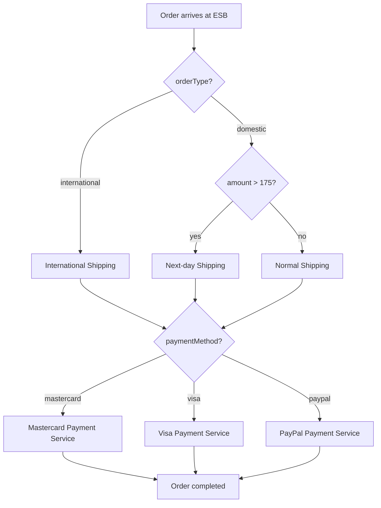

# Spring Integration Lab

## 1. Overview

This lab implements an ESB-based integration workflow using Spring Boot and Spring Integration.

The final solution includes:

- 3 shipping paths:
  - Next-day shipping for domestic orders with amount `> 175`
  - Normal shipping for domestic orders with amount `< 175`
  - International shipping for orders with `orderType=international`
- Payment routing after shipping:
  - Mastercard payment service
  - Visa payment service
  - PayPal payment service
- A centralized monitoring app that logs all processing steps in one place.

## 2. Architecture (Including Simplified Diagram)

### Architectural style: ESB with channel-based routing

`EnterpriseServiceBus` is the central orchestrator.  
Domain services (warehouse, shipping variants, payment) are external endpoints invoked by ESB activators.

### Simplified diagram

```mermaid
flowchart TD
    OS[OrderService] -->|POST /orders| ESB[EnterpriseServiceBus:8080]
    ESB --> WHC[warehousechannel]
    WHC --> WA[WarehouseActivator]
    WA -->|POST /orders| WH[WarehouseService:8081]
    WA --> OT[Router #1: orderType]

    OT -->|international| ISC[internationalShippingChannel]
    OT -->|domestic| DA[domesticAmountRouterChannel]

    DA -->|amount > 175| NDC[nextDayShippingChannel]
    DA -->|amount < 175| NSC[normalShippingChannel]

    ISC --> ISA[InternationalShippingActivator]
    NDC --> NDA[NextDayShippingActivator]
    NSC --> NSA[NormalShippingActivator]

    ISA -->|POST /orders| IS[InternationalShippingService:8084]
    NDA -->|POST /orders| NDS[ShippingService (Next-day):8082]
    NSA -->|POST /orders| NS[NormalShippingService:8083]

    ISA --> PR[paymentRouterChannel]
    NDA --> PR
    NSA --> PR

    PR --> PM[Router #3: paymentMethod]
    PM -->|mastercard| MCP[MastercardPaymentActivator]
    PM -->|visa| VP[VisaPaymentActivator]
    PM -->|paypal| PP[PaypalPaymentActivator]

    MCP -->|POST /payments/mastercard| PAY[PaymentService:8085]
    VP -->|POST /payments/visa| PAY
    PP -->|POST /payments/paypal| PAY

    ESB -->|POST /events| MON[MonitoringService:8088]
    WH -->|POST /events| MON
    NDS -->|POST /events| MON
    NS -->|POST /events| MON
    IS -->|POST /events| MON
    PAY -->|POST /events| MON
```

### Routing logic (decision-only view)



```text
OrderService -> POST /orders -> ESB (8080)
                               |
                               v
                    warehousechannel
                               |
                               v
                        WarehouseService (8081)
                               |
                               v
                    Router #1: orderType
                      |                     |
          internationalShippingChannel   domesticAmountRouterChannel
                      |                     |
                      v                     v
     InternationalShippingService (8084)  Router #2: amount > 175 ?
                                                |                 |
                                                v                 v
                                   NextDayShipping (8082)   NormalShipping (8083)
                                                \                 /
                                                 \               /
                                                  v             v
                                               paymentRouterChannel
                                                     |
                                                     v
                               Router #3: paymentMethod (mastercard|visa|paypal)
                                    |                    |                    |
                                    v                    v                    v
                              /payments/mastercard   /payments/visa     /payments/paypal
                                     (PaymentService, 8085)

All services -> POST /events -> MonitoringService (8088)
```

## 3. Implemented Functional Requirements

- ESB receives orders at `POST /orders`.
- Order model includes:
  - `orderType`: `domestic` or `international`
  - `paymentMethod`: `mastercard`, `visa`, or `paypal`
- Router #1 routes by `orderType`.
- Router #2 routes domestic orders by amount threshold (`175`).
- Router #3 routes payment by `paymentMethod`.
- Shipping is performed before payment.
- Monitoring service receives events from all stages and prints a centralized timeline.

## 4. Technologies Used

- Java 17
- Spring Boot 3.5.6
- Spring Integration (XML configuration)
- Spring Web (`RestController`, `RestTemplate`)
- Maven Wrapper (`mvnw`, `mvnw.cmd`)

## 5. How to Run

### Prerequisites

- Java 17 enabled (`java -version`)
- Internet access on first build

### Build

Run in each module:

```powershell
.\mvnw.cmd clean -DskipTests package
```

### Start services (required order)

Open terminals in `springintegration` and start in this order:

```powershell
# 1) Monitoring
cd MonitoringService
.\mvnw.cmd spring-boot:run

# 2) Warehouse
cd ..\WarehouseService
.\mvnw.cmd spring-boot:run

# 3) Next-day shipping
cd ..\ShippingService
.\mvnw.cmd spring-boot:run

# 4) Normal shipping
cd ..\NormalShippingService
.\mvnw.cmd spring-boot:run

# 5) International shipping
cd ..\InternationalShippingService
.\mvnw.cmd spring-boot:run

# 6) Payment
cd ..\PaymentService
.\mvnw.cmd spring-boot:run

# 7) ESB
cd ..\EnterpriseServiceBus
.\mvnw.cmd spring-boot:run

# 8) Order producer (sends sample orders and exits)
cd ..\OrderService
.\mvnw.cmd spring-boot:run
```

## 6. Processing Flow

1. `OrderService` posts sample orders to ESB:
   - `D100` domestic, amount `120`, payment `mastercard`
   - `D200` domestic, amount `250`, payment `visa`
   - `I300` international, amount `90`, payment `paypal`
2. ESB sends each order to warehouse step.
3. Router #1 checks `orderType`.
4. For domestic orders, Router #2 checks amount:
   - `> 175` -> next-day shipping
   - `< 175` -> normal shipping
5. After shipping, Router #3 checks `paymentMethod`.
6. Selected payment endpoint processes payment.
7. Each step reports to MonitoringService (`/events`).

## 7. Architectural Decisions

- ESB is the single orchestration point for all routing logic.
- Routers are declarative in `esbconfig.xml`, keeping policy centralized.
- Shipping and payment are externalized as independent services.
- Monitoring is separated into a dedicated app to provide one consolidated process view.
- Monitoring calls are best-effort and do not block order processing.

## 8. Possible Future Improvements

- Add async messaging (Kafka/RabbitMQ) between stages.
- Add retry, timeout, and circuit breaker policies.
- Add persistent event store for monitor history.
- Add distributed tracing and metrics (Micrometer/Prometheus).
- Add integration tests validating each routing branch.

## Monitoring (Explicit Requirement: item d)

Monitoring is implemented by a dedicated service:

- `MonitoringService` exposes `POST /events` (port `8088`).
- ESB + Warehouse + Shipping services + Payment service send monitor events.
- Monitoring prints all steps in one place.

Example centralized monitor lines:

```text
[MONITOR] source=ESB order=D200 step=Order received by ESB: Order{...}
[MONITOR] source=ESB order=D200 step=Warehouse step for order D200
[MONITOR] source=ESB order=D200 step=Routing to NEXT-DAY shipping for order D200
[MONITOR] source=ShippingService order=D200 step=Next-Day Shipping Service receiving order: Order{...}
[MONITOR] source=ESB order=D200 step=Routing payment to VISA for order D200
[MONITOR] source=PaymentService order=D200 step=Visa Payment Service paid order: Order{...}
```

This gives end-to-end visibility of the whole order processing process in one console.
